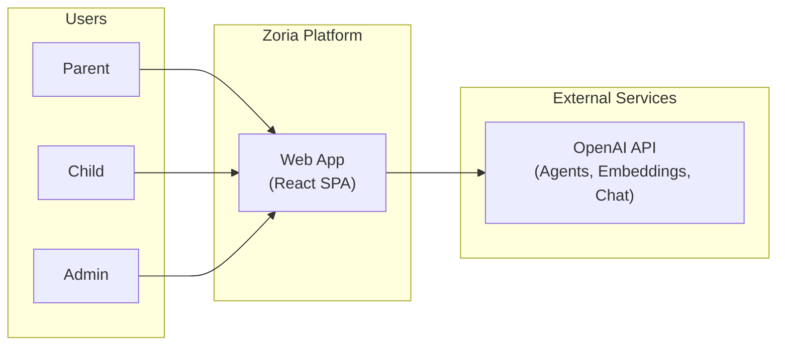
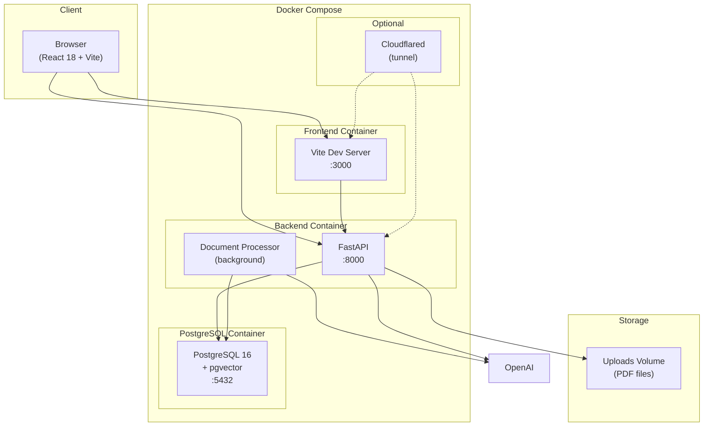
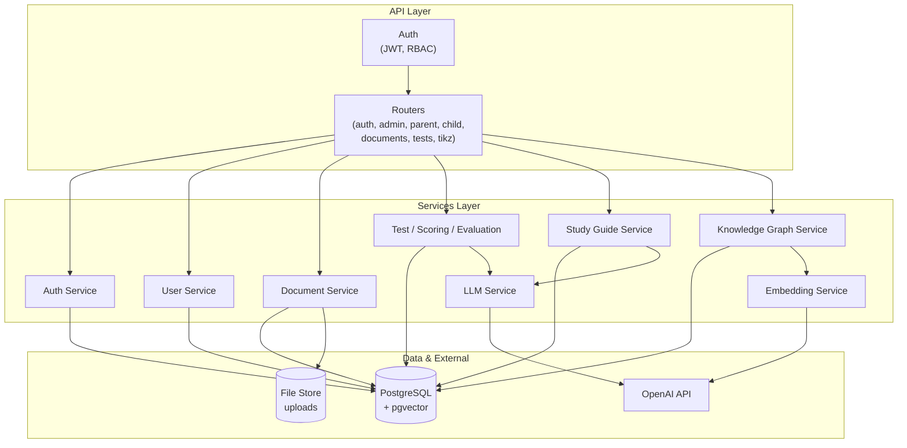
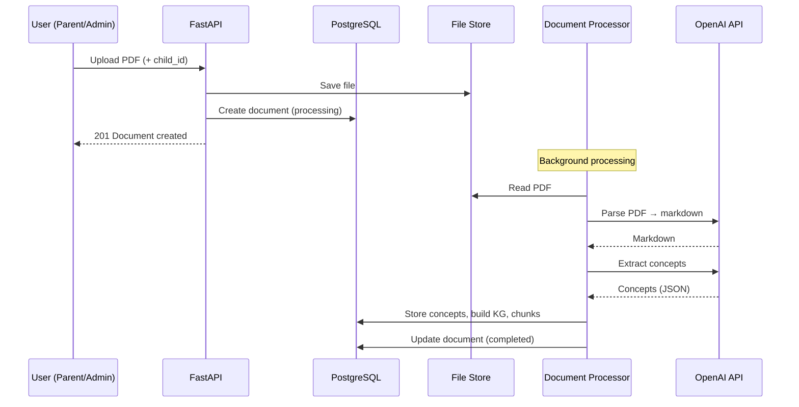
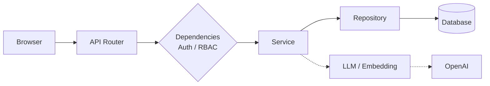
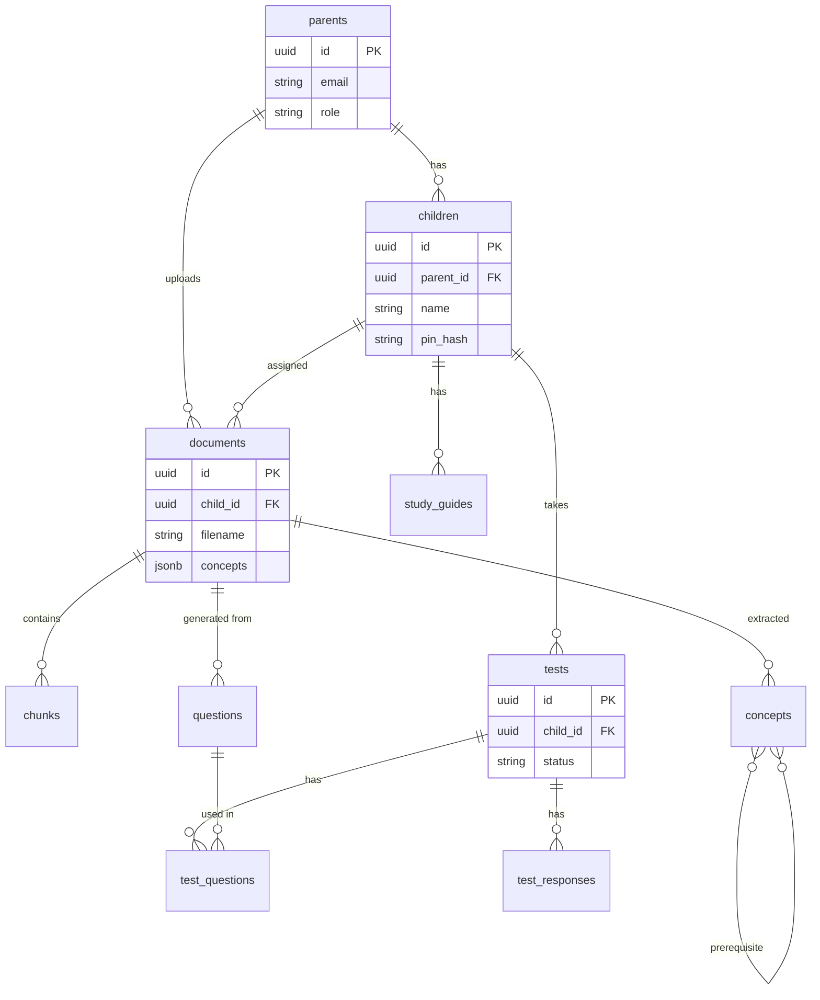

# Zoria — High-Level Architecture Diagrams

Mermaid diagrams for system context, components, and main flows. They render in GitHub, GitLab, VS Code markdown preview, and [Mermaid Live Editor](https://mermaid.live).

---

## 1. System Context (Users & External Systems)

---

## 2. Deployment / Containers

---

## 3. Backend Components & Data Stores

---

## 4. Document Processing Flow

---

## 5. Request Flow (Typical API Call)

---

## 6. Data Model (Core Entities)

---

## Exporting as Images

To get PNG/SVG for slides or wikis:

1. Copy a Mermaid code block into [Mermaid Live Editor](https://mermaid.live) and export.
2. Or use the Mermaid CLI: `npx @mermaid-js/mermaid-cli -i ARCHITECTURE_DIAGRAM.md -o diagrams/` (with appropriate config to split diagrams).

See also: [Architecture & Features (Technical)](ARCHITECTURE_AND_FEATURES_TECHNICAL.md).
