# Zoria — Science Fair–Style Diagrams

This document contains **architecture**, **sequence**, **component**, and **flow** diagrams suitable for presentations, posters, or documentation. All diagrams use [Mermaid](https://mermaid.js.org/) and render in GitHub, GitLab, VS Code markdown preview, and [Mermaid Live Editor](https://mermaid.live).

---

## 1. High-Level Architecture (Layered View)

**Purpose:** One-page view of how users, the app, and external systems fit together.

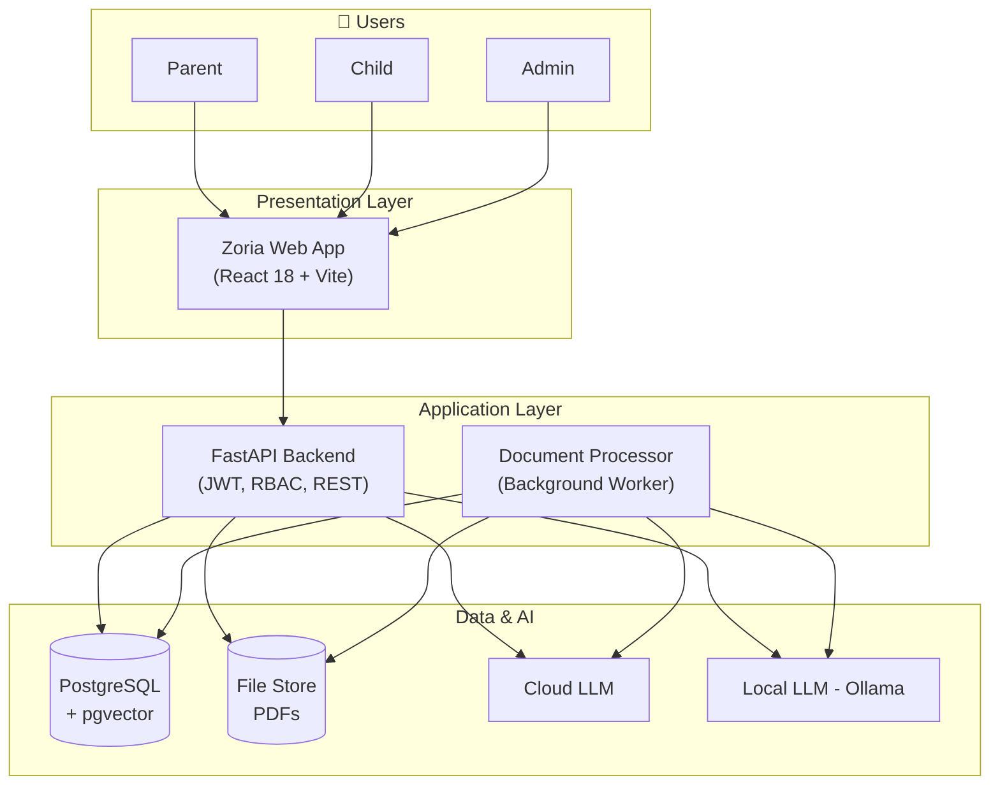

---

## 2. System Context (Actors & Systems)

**Purpose:** Who uses Zoria and what external systems it talks to.

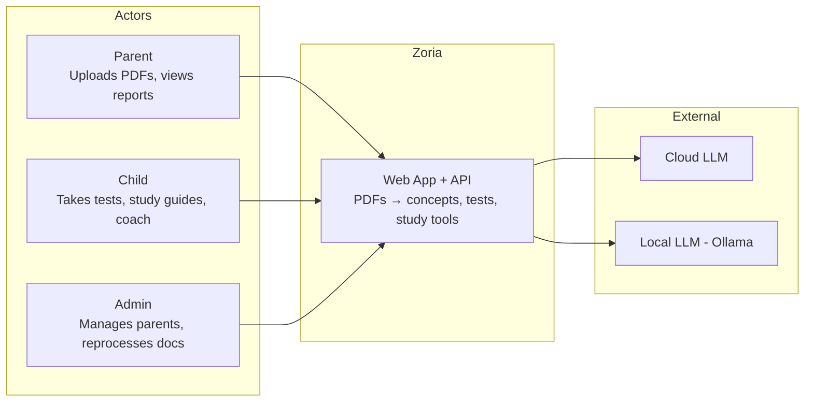

---

## 2b. Architecture: Actors, Engines & Operations

**Purpose:** Actors (Admin, Parent, Child), main engines with sub-components, and labeled operations.

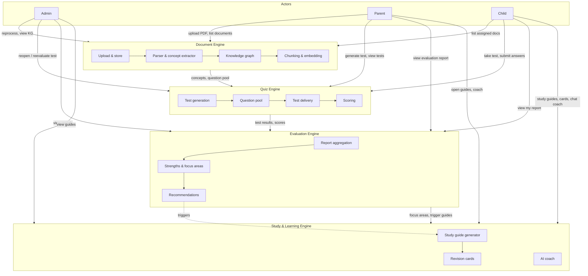

**Notes:** **Document Engine:** Upload & store → Parser & concept extractor (LLM) → Knowledge graph (concepts, prerequisites) → Chunking & embedding. **Quiz Engine:** Test generation (from concepts) → Question pool → Test delivery → Scoring (deterministic / heuristic / LLM). **Evaluation Engine:** Report aggregation (completed tests) → Strengths & focus areas (e.g. ≥70% / &lt;60%) → Recommendations. **Study & Learning Engine:** Study guide generator (per focus area), Revision cards, AI coach (chat in context). Dotted arrow: evaluation recommendations trigger study guide generation. Internal arrows show flow within each engine.

---

## 3. Deployment Architecture

**Purpose:** Where each part of Zoria runs (containers and storage).

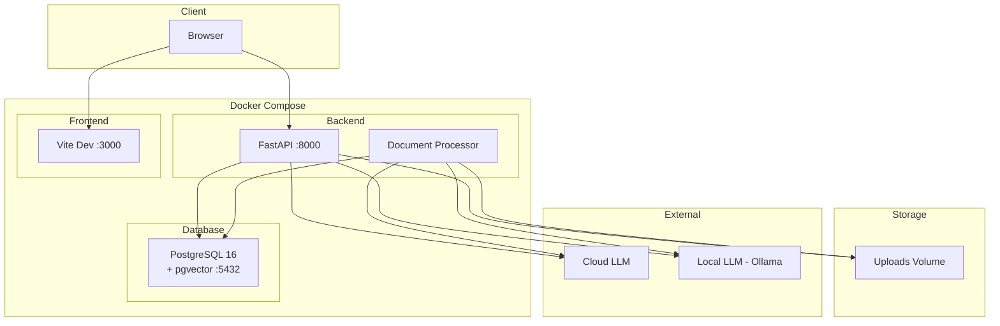

---

## 4. Sequence: Document Ingestion (Upload → Ready)

**Purpose:** Step-by-step flow from PDF upload to “ready” document (Phase 1 + Phase 2).

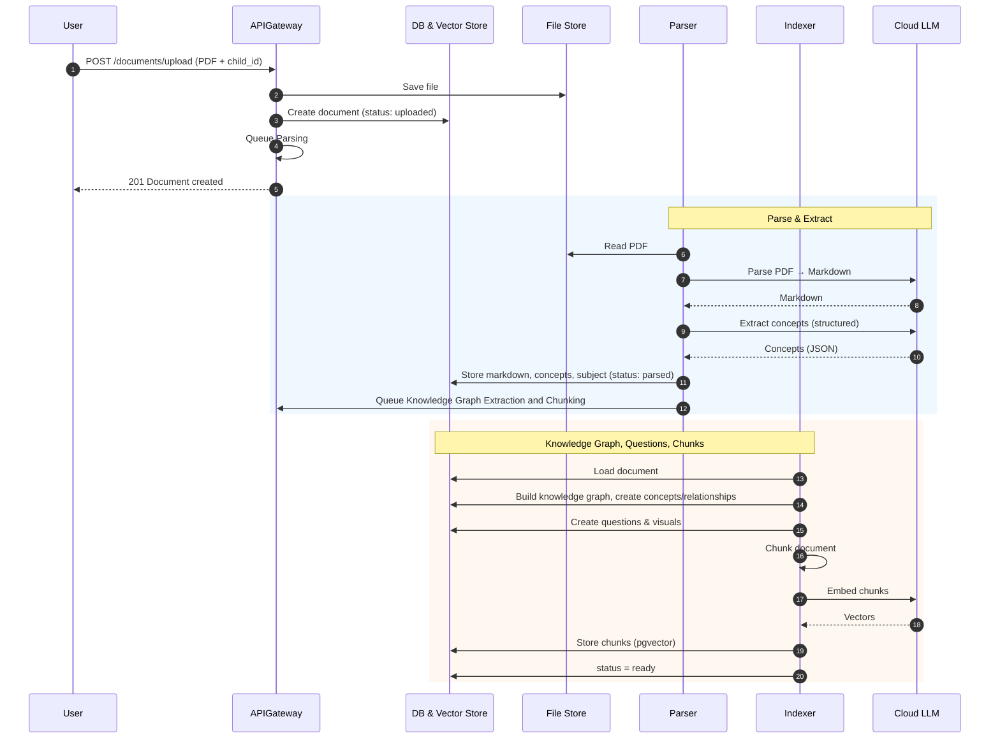

---

## 4b. Flow: Document Ingestion (Logical)

**Purpose:** Document ingestion at logical level — what happens, sync vs async, and where LLMs are used.

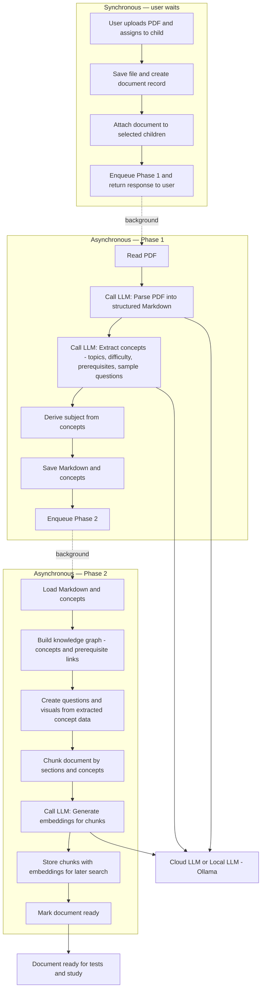

**Notes:** **Synchronous:** User gets a response right after the document is enqueued. **Asynchronous:** Phase 1 and Phase 2 run in the background (dotted arrows show handoff). **LLM calls:** Parse (Phase 1), Concept extraction (Phase 1), and Embeddings (Phase 2) use either **Cloud LLM** or **Local LLM (Ollama)** depending on configuration. The rest of Phase 2 (knowledge graph, questions, chunking, storage) uses the database and no LLM.

---

## 5. Sequence: Take Test & Get Score

**Purpose:** Flow from starting a test to receiving score and mastery update.

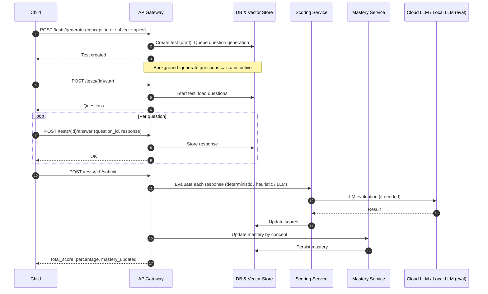

---

## 6. Component Diagram — Backend

**Purpose:** Main backend components and how they depend on each other.

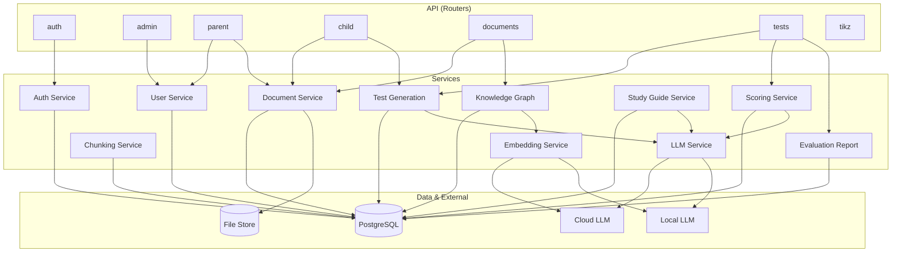

---

## 7. Component Diagram — Frontend (Main UI)

**Purpose:** Main frontend areas and key components.

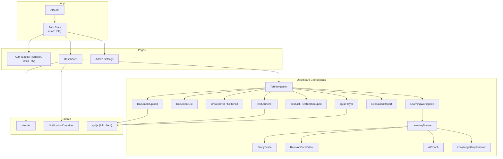

---

## 8. User Flow: Parent → Document → Child Test

**Purpose:** End-to-end journey from parent uploading a PDF to child taking a test.

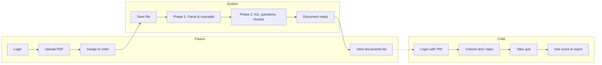

---

## 9. Process Flow: Document Status Lifecycle

**Purpose:** States a document goes through from upload to ready or failed.

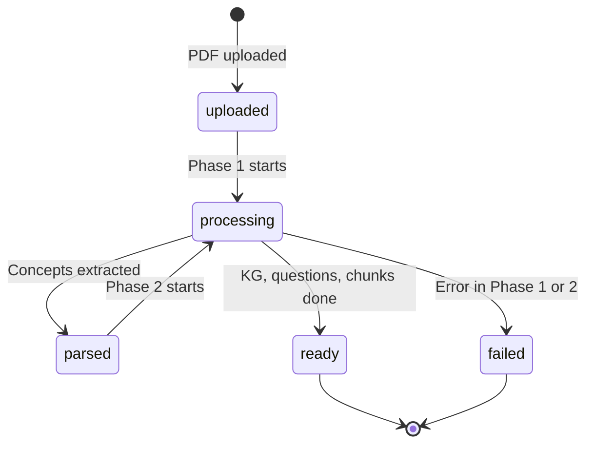

---

## 9b. Example: Knowledge Graph (Visual)

**Purpose:** What the knowledge graph looks like — concepts as nodes, prerequisite relationships as directed edges (learn order). Example based on a Mathematics-style hierarchy.

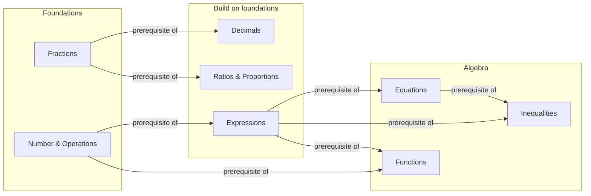

**Same structure, vertical (learn order top → bottom):**

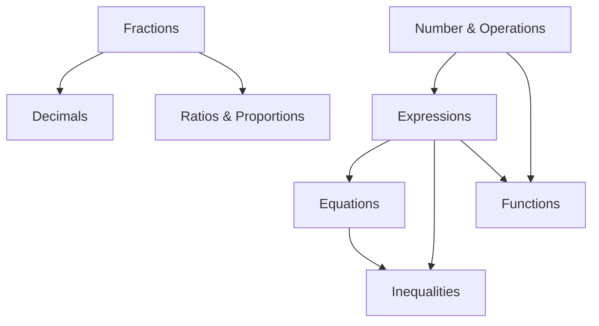

**Notes:** Each **node** is a concept (name, optional subtopic/difficulty). Each **arrow** is a `prerequisite_of` relationship: **A → B** means “learn A before B.” Stored in `concepts` and `concept_relationships` (from_concept_id, to_concept_id, relationship_type). Test generation can “include prerequisites” so a test on e.g. Equations also pulls in questions from Expressions. The real graph is built per document from the Concept Extractor output; this diagram is a typical Mathematics-style example.

---

## 10. Flow: Test Generation

**Purpose:** How a test is generated — inputs, vector/store usage, and question selection.

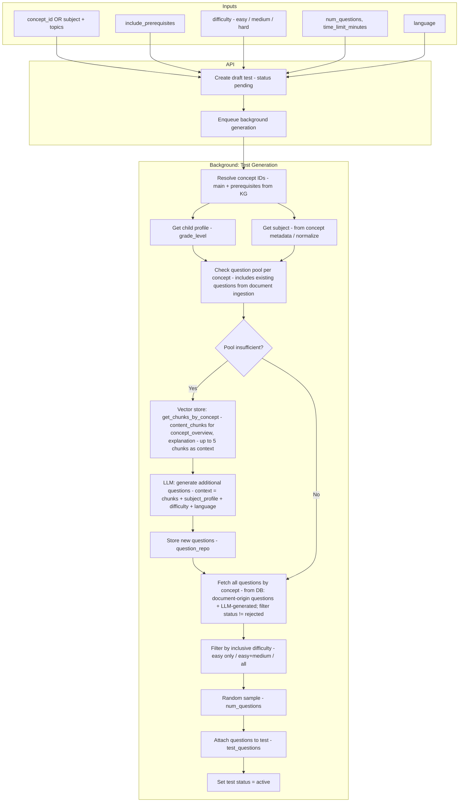

**Notes:** The **question pool** includes **existing questions from the uploaded document**: during document ingestion (Phase 2), the Concept Extractor’s per-concept `questions` are stored in the `questions` table. Test creation uses these when the pool is sufficient. When the pool is **insufficient**, the system fetches **content_chunks** (by concept_id) as context for the LLM, generates additional questions, stores them, then either uses only the newly generated set for this test or all questions for the concept (implementation may filter to the new batch when LLM ran). Question generation uses chunks as study context; no vector similarity search at generation time. Questions are stored with optional embeddings for **semantic deduplication** (e.g. find_similar_questions). Test can be created from **concept_id** or **subject + topics**.

---

## 11. Flow: Test Evaluation (Scoring)

**Purpose:** How a single response is graded — routing by question type and use of deterministic, heuristic, or LLM evaluator.

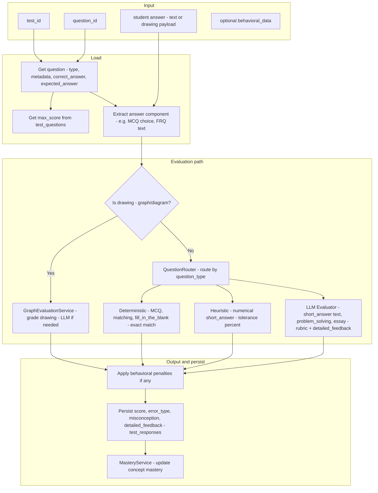

**Routing (question_type → evaluator):**  
- **multiple_choice, matching, fill_in_the_blank** → Deterministic (exact/match).  
- **short_answer** (numerical) → Heuristic (tolerance); (text) → LLM.  
- **problem_solving, conceptual_question, essay, free_response** → LLM (rubric, detailed feedback).

---

## 12. Flow: Evaluation Report and Study Guide

**Purpose:** How the evaluation report is built and how study guides are triggered for focus areas.

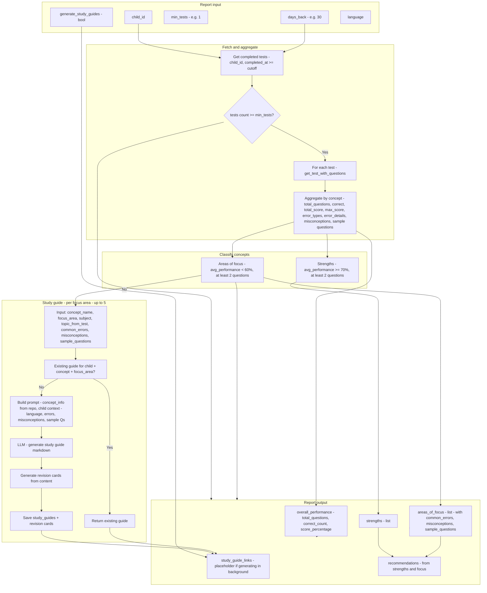

**Notes:** Report uses **completed tests** in the window only. **Strengths** = concepts with avg (accuracy + score%) / 2 ≥ 70%; **areas of focus** = below 60%. Study guides are generated per focus area (subject + topic from test required); prompt uses concept info, common_errors, misconceptions, and sample questions — no vector search. Guides can be returned as placeholders while generated in background.

---

## 13. Data Flow: Core Entities

**Purpose:** How main entities relate (simplified ER for a poster).

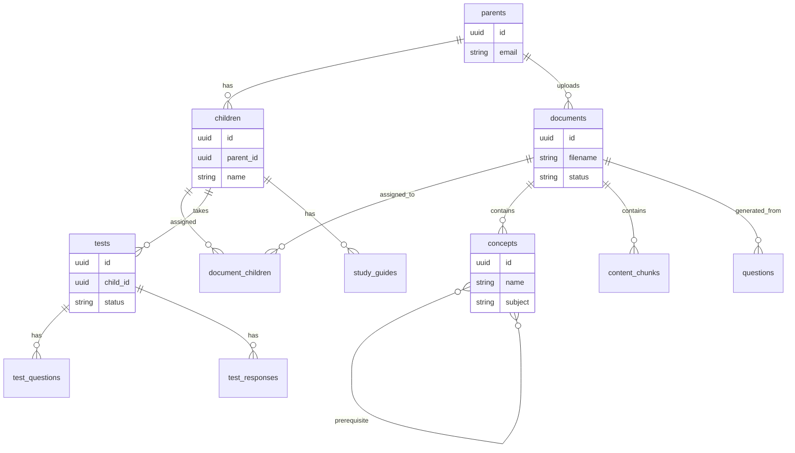

---

## Exporting as Images (Science Fair / Slides)

1. **Mermaid Live Editor:** Copy a code block into [mermaid.live](https://mermaid.live), then use **Export** → PNG or SVG.
2. **VS Code:** Use a “Mermaid” or “Markdown Preview Mermaid” extension and export from preview.
3. **CLI:**  
   `npx @mermaid-js/mermaid-cli -i docs/DIAGRAMS_SCIENCE_FAIR.md -o docs/diagrams/`  
   (with a config that outputs one image per diagram if needed.)

For a **science fair poster**, use the **Layered Architecture (Section 1)**, **Document Ingestion Sequence (Section 4)**, **User Flow (Section 8)**, and the **Test Generation / Evaluation / Report flows (Sections 10–12)** for a clear story: what Zoria is, how a document becomes ready, and how a child gets from PDF to quiz.

See also: [ARCHITECTURE_DIAGRAM.md](ARCHITECTURE_DIAGRAM.md), [DETAILED_FLOWS.md](DETAILED_FLOWS.md), [ARCHITECTURE_AND_FEATURES_TECHNICAL.md](ARCHITECTURE_AND_FEATURES_TECHNICAL.md).
