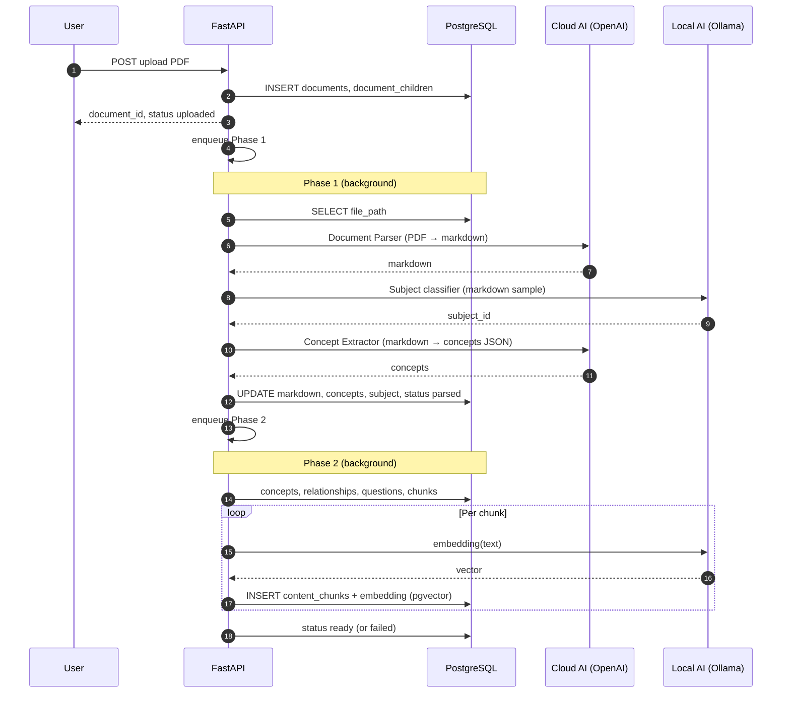
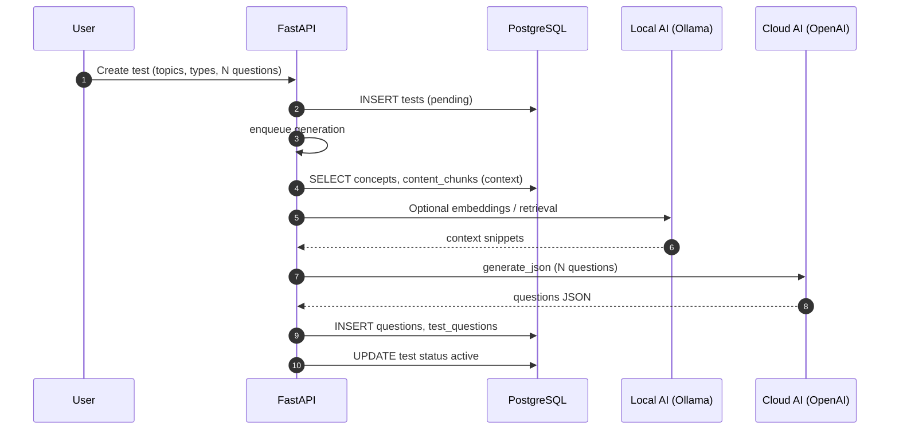
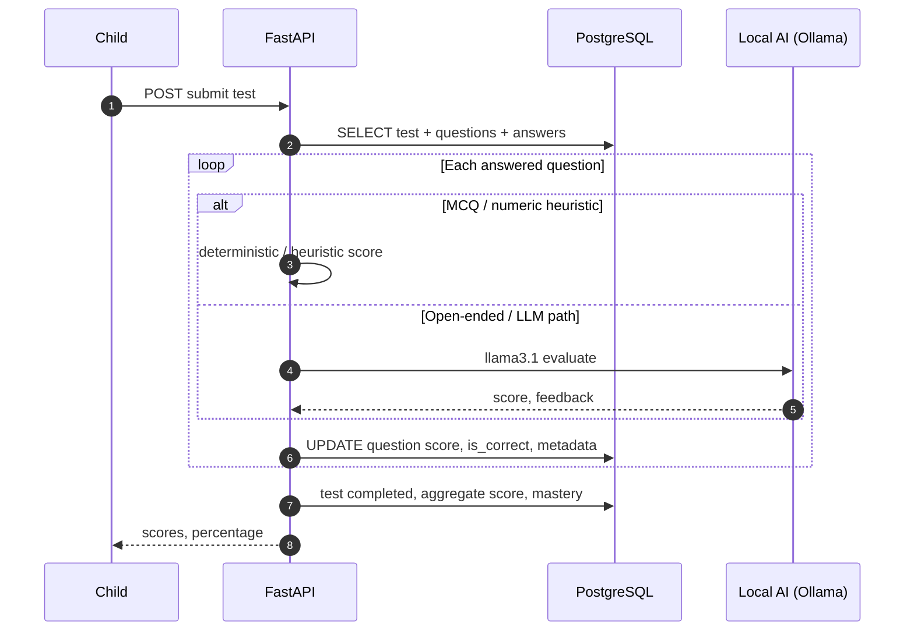
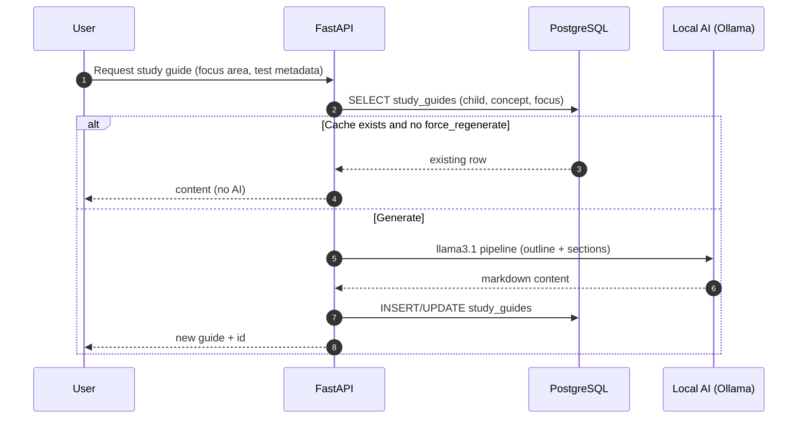
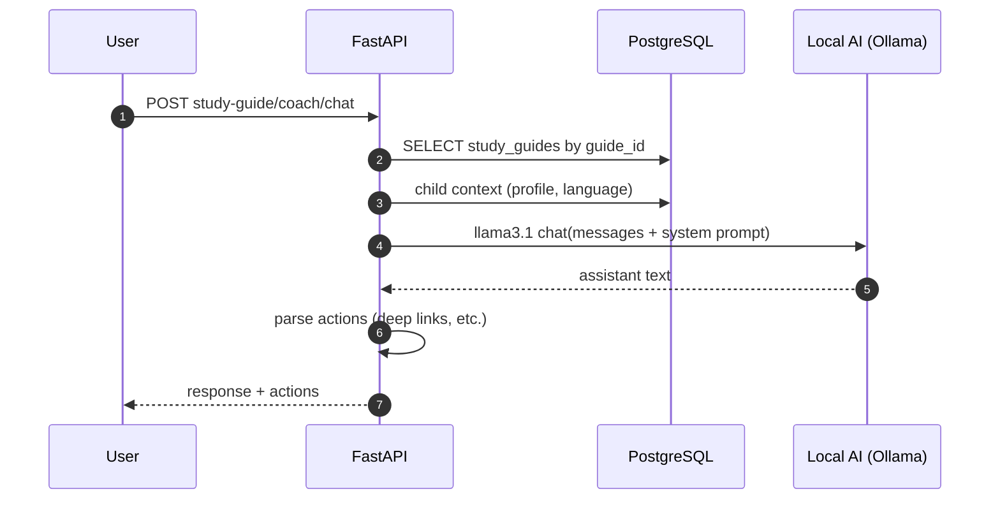

# Zoria — System flows (user input · DB · AI local/cloud · output)

This document summarizes the four main product flows with **what hits the database**, **which AI is local (Ollama) vs cloud (OpenAI)**, and **what is produced**. For API-level step-by-step detail, see [`DETAILED_FLOWS.md`](./DETAILED_FLOWS.md).

**Legend**

| Symbol | Meaning |
|--------|---------|
| **User** | Browser / API caller |
| **DB** | PostgreSQL (+ **pgvector** for chunk embeddings) |
| **Cloud AI** | OpenAI (Agents / Chat Completions); models like `gpt-5-mini`, `gpt-5-nano`, `QUESTION_GENERATION_MODEL` (e.g. `gpt-5-nano`) |
| **Local AI** | Ollama — embeddings (`mxbai-embed-large`), subject tag (`llama3.2`), study guide & coach & eval (`llama3.1`) |

**Code reference:** `LLMService` routes `gpt-*` → OpenAI; all other model names → Ollama (`OLLAMA_BASE_URL`).

---

## 1. Document ingestion

### Summary table

| Stage | User input | DB | AI | Output |
|-------|------------|----|----|--------|
| Upload | PDF + optional child link | `documents` (path, `uploaded`) | — | `document_id`; Phase 1 queued |
| Phase 1 | — | Read path; write `markdown_content`, `concepts`, `subject`; status `parsed` | **Cloud:** PDF→markdown (Document Parser), markdown→concepts (Concept Extractor). **Local:** subject from markdown snippet | Structured markdown + concept JSON + subject |
| Phase 2 / Rebuild KG | Admin “Rebuild KG” (optional) | Concepts, relationships, questions, `content_chunks` + vectors, skills links | **Local:** chunk embeddings via Ollama | KG + searchable chunks |

### Sequence (Mermaid)

---

## 2. Test generation & evaluation

### Summary table

| Step | User input | DB | AI | Output |
|------|------------|----|----|--------|
| Create / launch test | Topics/concept, difficulty, count, question types, language | `tests`, metadata; read `concepts`, chunks for context | — | Pending test |
| Generate questions | (background) | Read context; **INSERT** `questions`, link `test_questions` | **Cloud:** question LLM (`QUESTION_GENERATION_MODEL`). **Local:** optional embedding retrieval for context | Question set on test |
| Answer | MCQ / typed answers | UPDATE responses on test questions | Usually none until submit | Saved answers |
| Submit | Submit test | Read test+answers; WRITE scores, completion; mastery tables | **Local:** `llama3.1` for LLM rubric items; deterministic/heuristic for MCQ/numeric | Score, %, mastery update |
| Admin reevaluate | Reevaluate completed test | Clear eval fields; re-grade | Same as submit | Refreshed scores |

### Sequence — generation

### Sequence — submit & grade

---

## 3. Study guide generation

### Summary table

| Step | User input | DB | AI | Output |
|------|------------|----|----|--------|
| Request | child_id, concept, focus_area, **subject + topic from test**, errors/misconceptions optional | **Read** `study_guides` cache key | If cache hit: **none** | Cached guide |
| Generate | Same + force_regenerate | **INSERT/UPDATE** `study_guides` (content, key_points, practice_recommendations) | **Local:** `llama3.1` — outline → sections → optional validation | Long-form study guide |

### Sequence

---

## 4. AI Assistant (AI Coach)

### Summary table

| Step | User input | DB | AI | Output |
|------|------------|----|----|--------|
| Chat | `guide_id`, `message`, `conversation_history`, optional language/context | **Read** study guide row; **Read** child profile (`get_child_context`) | **Local:** `llama3.1` chat (Socratic system prompt) | Assistant text + parsed `actions` |
| Persistence | Client sends history each turn | Optional **llm_call_logs** | — | — |

### Sequence

---

## Quick reference — which model where

| Capability | Typical model | Provider |
|------------|---------------|----------|
| PDF → markdown | `gpt-5-mini` | OpenAI Agents |
| Markdown → concepts | `gpt-5-nano` | OpenAI Agents |
| Subject classification | `llama3.2:3b-instruct-fp16` | Ollama |
| Chunk embeddings | `mxbai-embed-large` | Ollama |
| Question generation | `QUESTION_GENERATION_MODEL` (default `gpt-5-nano`) | OpenAI |
| Test grading (LLM path) | `llama3.1` | Ollama |
| Study guide | `llama3.1` | Ollama |
| AI Coach | `llama3.1` | Ollama |

---

*Last updated to match backend layout: FastAPI routers under `backend/api/v1/`, workers in `backend/workers/`, workflows in `backend/workflows/workflow.py`.*
